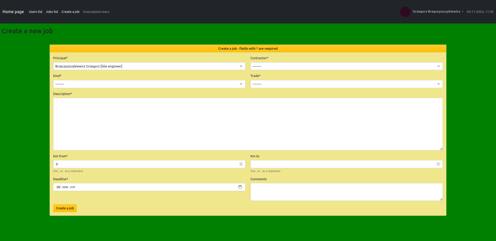

# Job Book App
Job book for managing construction jobs, mainly between surveyors and the general contractor.

## Table of Contents
* [General info](#general-info)
* [Technologies Used](#technologies-used)
* [Features](#features)
* [Screenshots](#screenshots)
* [Setup](#setup)
* [Usage](#usage)
* [Project Status](#project-status)
* [Contact](#contact)

## General info
According to my professional experience, I decided to create a job book to simplify communication.
Usually, such jobs were entered into Excel or handled over the phone, which caused a lot of
misunderstandings. My main goal was to create an application in which we could create jobs, change
statuses and assigned people and everyone will be able to see it. 
To understand the essence of how this job book works, you need to know:
* the body supervising the construction is the general contractor, which commissions the executions of
  jobs to the subcontractors, surveyors
* we can have two kinds of jobs: staking out and as-built inventory (also other type is provided)
* we can have different statuses of the job, depending on the kind of the job:
  * STAKING OUT: waiting -> accepted or refused (this status ends the job) -> making documents ->
    ready to stake out -> ongoing -> finished
  * AS-BUILD INVENTORY: waiting -> accepted or refused (this status ends the job) -> ongoing ->
    data passed -> making documents -> finished
  * OTHER -> waiting -> accepted or refused (this status ends the job) -> ongoing -> finished

## Technologies Used
Project was created with:
* Python version: 3.10.11
* Django==4.2.16
* psycopg2-binary==2.9.9
* Faker==30.3.0
* ipython==8.28.0
* pre_commit==4.0.1
* django-bootstrap-v5==1.0.11
* pytest-django==4.9.0
* pytest-factoryboy==2.7.0
* freezegun==1.5.1
* parameterized==0.9.0
* isort==5.13.2
* pillow==10.4.0
* celery==5.4.0
* redis==5.1.1
* django-crispy-forms==2.3
* crispy-bootstrap5==2024.10

## Features
* Registration of user
* Login and logout user
* Accept or delete a new user by admin
* Displaying a list of all users on the construction site with their data
* Panel page, where users see their data and jobs statistics
* Creating a new job
* Changing the statuses and assigned user to the job with the e-mails notifications
* User jobs page, where he can filter the jobs by his role (principal/contractor) and statuses
* List of jobs visible to all users, where you can sort the most important columns

## Screenshots

### Registration:

### Login:

### Panel:

### Users list:

### Accept or delete a new user:

### Job create:

### Job:

### My jobs:

### Jobs list:

## Setup
Project requirements are in _requirements.txt_.  
To get started:
* `sudo apt install redis`
* `pip install -r requirements.txt`
* `python manage.py migrate`
* `python manage.py runserver`
 
To populate the database with fake data:
* `./manage.py populate_trades`
* `./manage.py populate_users`
* `./manage.py populate_jobs`

## Usage
* After you clone this repo to your desktop, go to its root directory and run `pip install -r requirements.txt`
to install its dependencies
* When the dependencies are installed, make migrations `python manage.py migrate` and run server
`python manage.py runserver` to start application
* You can populate you date with fake data for which there are ready-made scripts (look at [setup](#setup))
* You will be able to access it at `http://127.0.0.1:8000/home-page/`

## Project Status
Backend is _complete_. 
Frontend _needs some works_.

## Contact
Created by _117marta_ - feel free to contact me!
